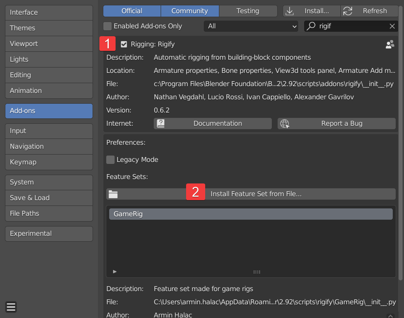
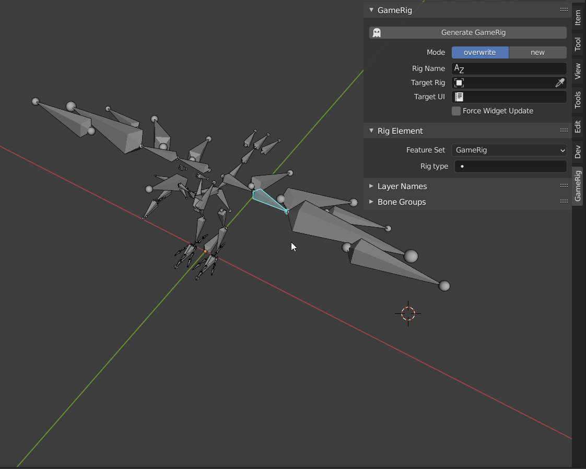

# GameRig

GameRig is an auto rigging for games addon for Blender.
It is a so called feature set made for creating game engine compatible rigs using a workflow built on top of the Rigify system.
The current version has been developed for use with Blender 2.92. Other versions might be compatible as well, this needs further testing. Will soon made sure it works with 2.93.

> ## Differences between GameRig and Rigify
> 
> There are three essential problems with Rigify when it comes to rigging for games:
> * The deformation bones, which is the only part that needs to be exported, are not in a single bone hierarchy. For that reason, many unnecessary bones will be exported together with the deform bones. Besides this resulting in adding unnecessary complexity, it could also produce root bone issues. Unreal Engine, for example, will compain if your skeleton has multiple root level bones.
> * Deformation bones are scaled. This can produce some weird behavior as scaling is handled completely differently in a Blender rig and in game engines.
> * Bendy bones are used for deformation. While this will not produce any errors because these bones will be exported as regular bones, it is still not desired to have them in the rig. Mainly because the deformation you will see in Blender will not reflect how this deformation will look in the game engine.

> GameRig solves all three of these problems. It puts the deformation bones in a single hierarchy for a clean export, scaling on deformation bones is disabled by default and there will be no bendy bones in the rig.

> ## Installation instructions
> 
> Download the latest release zip file from:
> 
> <https://github.com/Arminando/GameRig/releases>
> 
> Go to Edit > Preferences > Add-ons and enable Rigify (1)
> 
> Click on Install Feature Set From File... and in the file browser select the zip file you downloaded earlier (2)
> 
> 
> 
> That is it already.
> 

> ## Usage instructions
> 
> Exactly the same as regular rigify but make sure to only use the rigs that have the "game." prefix.

> ## UI
> 
> In version 0.0.3 a new UI has been added to the 3D view side panel.
> Some general notes about the UI:
> * You always have access to the Bone Groups and Layer Names panels
> * The GameRig panel is available only in Object and Pose modes. This is where you will be triggering the rig build from
> * The Rig Element panel will show up only in Pose mode and when you have a Bone selected that Rig Type assigned
> * To add rig samples, you need to switch into Edit mode and the GameRig panel will change to provide you with the rig samples list
> 
> 

> ## The future
>
> The first stage for GameRig was to take what is already in Rigify and make a game friendly version of it. That part is done and I can focus on making this into a fully featured and more flexible tool.
> Some of the things I will be working on next:
> * Add rig types that are missing. Things like sliders, better face components etc.
> * Provide a better space switching solution
> * Add option for custom pre and post build scripts
> * Create a system for corrective bone behavior to enable better deformations
> * Provide the means to quickly rig assets from software like MetaHuman, Character Creator 3, Daz3D etc.
> * And more to come

> If you want to be help, join my  and support GameRig. There you will also find numerous tutorials that will teach you how to rig, paint weights and many other things.
> 
